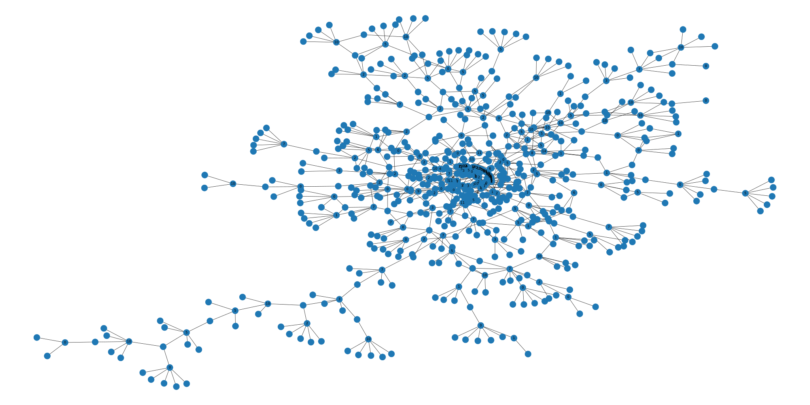

---

Creates a dataset from novelupdates (https://www.novelupdates.com) containing information about translated novels.
The dataset contains translated English novels from eight different original languages. There is currently a total of 13,592 novels.  

Current Version: 0.1.3  
Updated on 2022-10-18  

Dataset columns:
* General Information
  * Novel ID
  * Name
  * Associated Names
  * Original Langauge	
  * Author / Authors
  * Genres
  * Tags
* Publishing Information
  * Start Year
  * Licensed
  * Original Publisher
  * English Publisher
* Chapter Information
  * Number of Chapters (original language)
  * Completed (original language)
  * Number of Chapters (translation)
  * Completed (translation)
* Release Information (translation)
  * Release Frequency
  * Activity Weekly Rank
  * Activity Monthly Rank
  * Activity All-time Rank
* Community Information (translation)
  * On Number of Reading Lists
  * Reading List Monthly Rank
  * Reading List All-time Rank
  * Rating
  * Rating Votes
* Related Series Information
  * Related Series IDs
  * Recommended Series IDs
  * Recommendation List IDs
